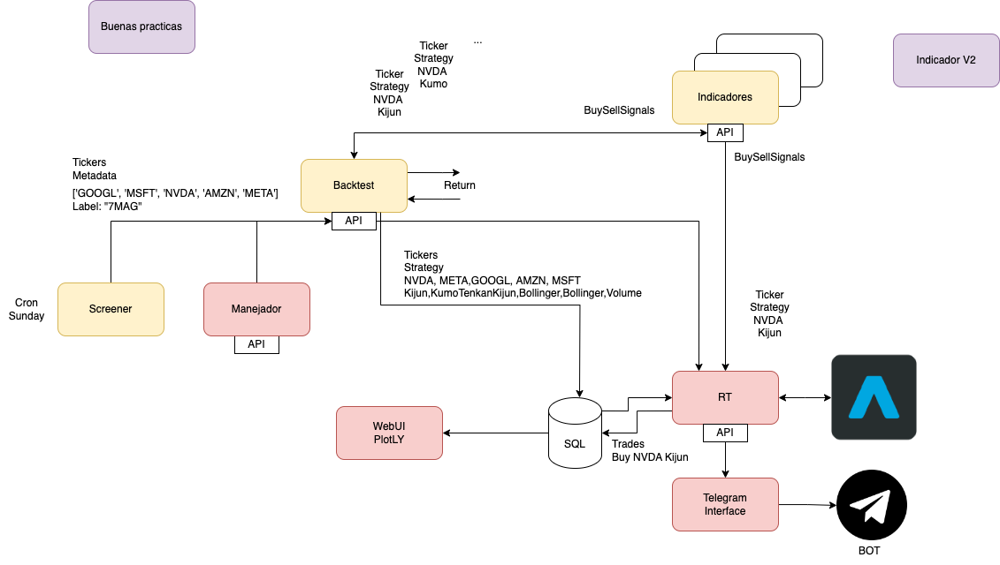

# TradingCore Infrastructure

**Description:**
This diagram illustrates the infrastructure of the TradingCore system
## Screener Module
The screener module is responsible for identifying potential investment opportunities based on value investing principles. This involves analyzing companies' fundamentals to find stocks that are undervalued relative to their intrinsic worth.

Value investing screening typically considers factors such as:

Price-to-Earnings (P/E) Ratio: A low P/E ratio suggests the stock may be undervalued.
Price-to-Book (P/B) Ratio: A low P/B ratio indicates the stock's market price is lower than its book value.
Dividend Yield: A high dividend yield suggests the company is returning a significant portion of its profits to shareholders.
Debt-to-Equity Ratio: A low debt-to-equity ratio indicates the company has a strong financial position.
Return on Equity (ROE): A high ROE indicates the company is efficiently using its shareholders' equity to generate profits.
Once the screener identifies stocks that meet these criteria, it sends them to the backtesting module.

## Backtesting Module
The backtesting module evaluates the profitability of potential trades using technical investing techniques, such as the Ichimoku Cloud. This involves simulating past trades to assess how the chosen strategy would have performed under different market conditions.

Ichimoku Cloud is a technical indicator that provides signals for potential support and resistance levels. It consists of five lines: the Tenkan-sen, Kijun-sen, Senkou Span A, Senkou Span B, and Chikou Span.

By analyzing the interactions between these lines, traders can identify potential entry and exit points for trades.

## Trade Configuration and Real-time Module
If the backtesting module determines that a trade is profitable, it saves the trade configuration (ticker, strategy) to a database and adds the ticker to the "to buy" list of the real-time module.

The real-time module monitors the market and executes trades based on the "to buy" list. When a stock on the list meets the specified entry conditions (e.g., price reaches a support level), the module will place a buy order.

The stock remains on the "to buy" list until it is removed by the screener (e.g., if the stock no longer meets the value investing criteria). Once the stock is removed, the real-time module can close the position if necessary.

Note: The specific implementation of these modules and the exact criteria used for screening and backtesting may vary depending on the trading strategy and risk tolerance of the investor.