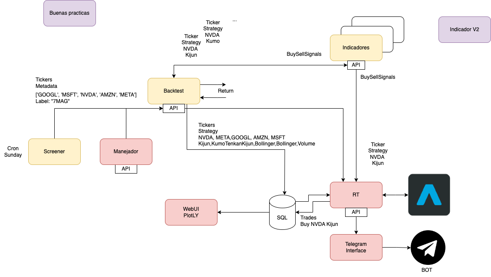
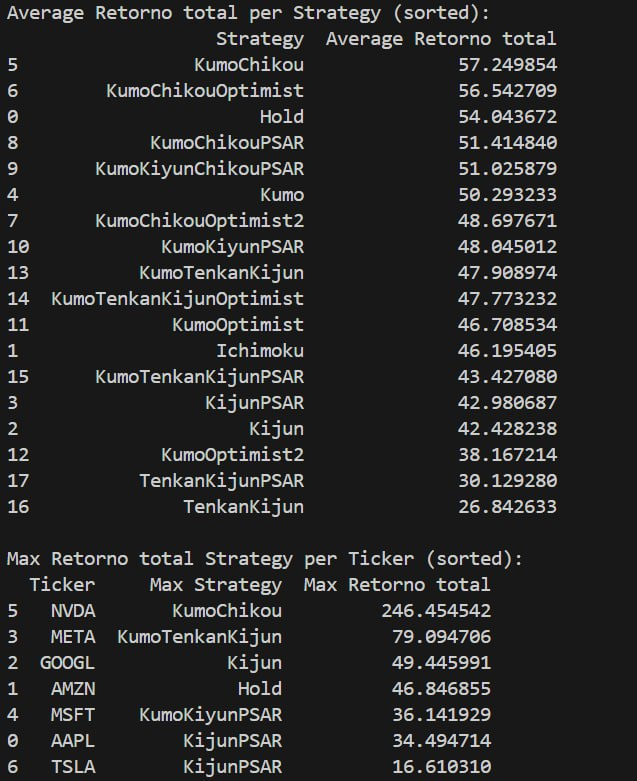
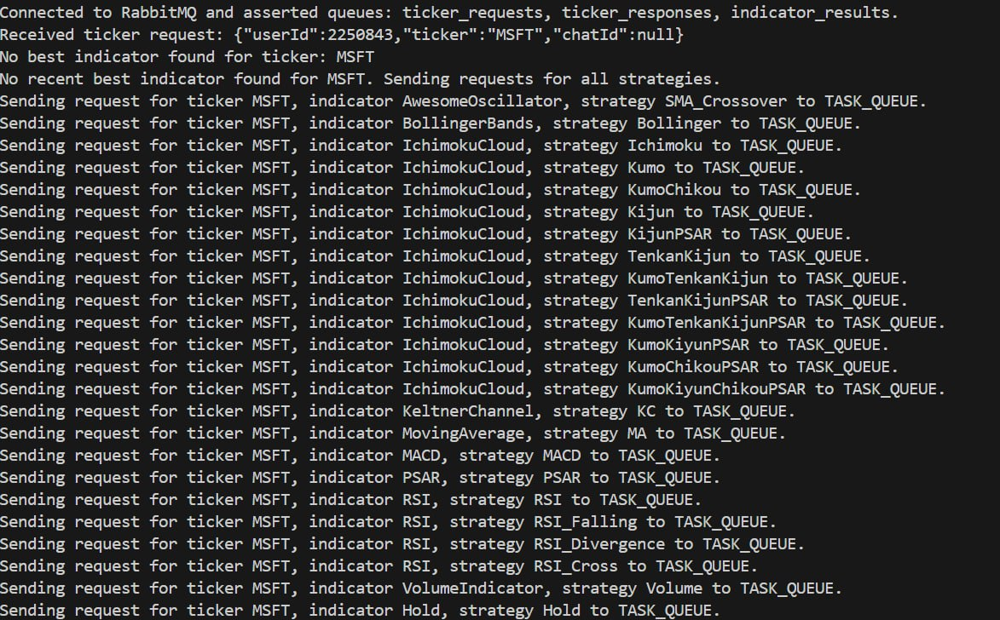
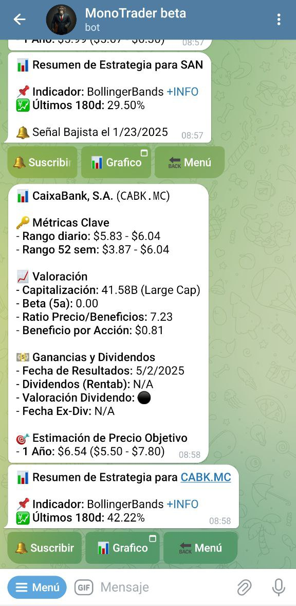

# TradingCore Infrastructure

The **TradingCore Infrastructure** is a modular system designed to streamline and automate trading workflows. It integrates various components, including indicators, orchestration, real-time monitoring, and communication, to provide a comprehensive trading solution. The system leverages the `tradingcore` library for managing financial data, implementing indicators, and performing backtesting.

## Infrastructure Diagram



The diagram above illustrates the architecture of the **TradingCore Infrastructure**, showcasing the interaction between its components, including the **Indicator App**, **Orchestrator**, **Telegram App**, and the **TradingCore Library**. This visual representation provides a clear understanding of how the system operates as a cohesive unit to support trading workflows.

---

## Components

### 1. **Indicator App**
The **Indicator App** is responsible for calculating and managing technical indicators used in trading strategies. It supports a wide range of indicators, including:

- **Ichimoku Cloud**: Provides support/resistance levels and trend signals.
- **Moving Averages**: Tracks price trends over time.
- **Parabolic SAR**: Identifies potential reversals in market trends.

This app integrates with the `tradingcore` library to calculate indicators and generate signals for backtesting and real-time trading.



This visualization provides insights into how indicators are calculated and their impact on trading decisions, showcasing the integration of the **TradingCore Library** with the **Indicator App**.

---

### 2. **Orchestrator**
The **Orchestrator** acts as the central hub for coordinating the various modules of the TradingCore system. Its responsibilities include:

- Managing workflows between the **Indicator App**, **Screener Module**, and **Real-time Module**.
- Scheduling backtesting tasks and real-time monitoring.
- Storing and retrieving trade configurations from the database.

The orchestrator ensures seamless communication between components and maintains the overall system's efficiency.



The log above illustrates how the **Orchestrator** communicates with the **Indicator App** and other modules via RabbitMQ. It showcases the flow of messages, including indicator replies.

---

### 3. **Telegram App**
The **Telegram App** provides real-time notifications and communication for trading activities. It allows users to:

- Receive alerts for buy/sell signals generated by the **Indicator App**.
- Monitor the status of trades executed by the **Real-time Module**.
- Interact with the system to query trade configurations or request updates.

This app ensures that traders stay informed and can make timely decisions.



The screenshot above demonstrates the **Telegram App** in action, showcasing a conversation with the bot. It includes real-time updates on trading signals, executed trades, and user interactions.

---

### 4. **TradingCore Library**
The **TradingCore Library** is the backbone of the infrastructure, offering core functionalities for:

- **Data Management**: Handles timeseries financial data using `pandas` and `yfinance`.
- **Indicators**: Implements technical indicators like Ichimoku Cloud, Moving Averages, and more.
- **Backtesting**: Simulates historical trades to evaluate the profitability of strategies.
- **Integration**: Provides APIs for seamless integration with other modules.

#### Example Usage:
```python
from tradingcore.data.timeseries import TimeSeriesData
from tradingcore.indicators.moving_average import MovingAverageIndicator
from tradingcore.backtesting.backtester import Backtester

# Initialize timeseries data
ts_data = TimeSeriesData('AAPL')

# Initialize indicator
ma_indicator = MovingAverageIndicator(window=20)

# Initialize backtester
backtester = Backtester(ts_data, ma_indicator)

# Run backtest
results = backtester.run_backtest()
print(results)